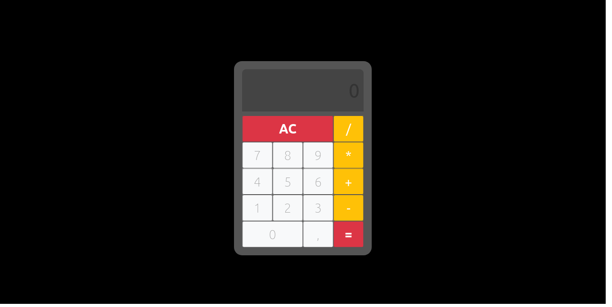

# Calculadora Svelte

<div align="center">  
  
  
  
  
  
  
</div>




> Calculadora simples feita com Svelte, parte do curso de Svelte da Cod3r Cursos

## 💻 Pré-requisitos

Antes de começar, verifique se você atendeu aos seguintes requisitos:

* Você instalou a versão mais recente de `NodeJS`, `Git`, e `Visual Studio Code` ou outra IDE de preferência.
* Você tem uma máquina da sua preferência. De preferência sistemas baseados em `Debian 10`.
* Você tem familiaridade com `Desenvolvimento front-end` e outras tecnologias adicionais.

## 🚀 Instalação

Para instalar, siga estas etapas:

Linux, Windows e macOS:
``` 
git clone https://github.com/eng-gabrielscardoso/calculadora-svelte.git
```

> Verifique se possui permissões para clonar o repositório com o administrador do projeto
## ☕ Utilização

Para usar, siga estas etapas:


1. No diretório da aplicação, rodar o comando para instalação de dependências:

```
npm install 
```

2. Rodar o comando para iniciar a aplicação

```
npm run dev
```

3. Começar a codar!

> Obs.: Caso não queira codar, basta iniciar a aplicação com 

```
npm start
```

## 🤝 Colaboradores

Agradecemos às seguintes pessoas que contribuíram para este projeto:

<table>
  <tr>
    <td align="center">
      <a href="#">
        <br>
        <sub>
          <b>Gabriel Cardoso</b>
        </sub>
      </a>
    </td>
  </tr>
</table>

## 📝 Licença

O projeto é livre e retirado como parte de uma das atividades proposta pelo curso de Intensivo de Svelte, realizado pela Cod3r Cursos.

[⬆ Voltar ao topo](#calculadora-svelte)<br>